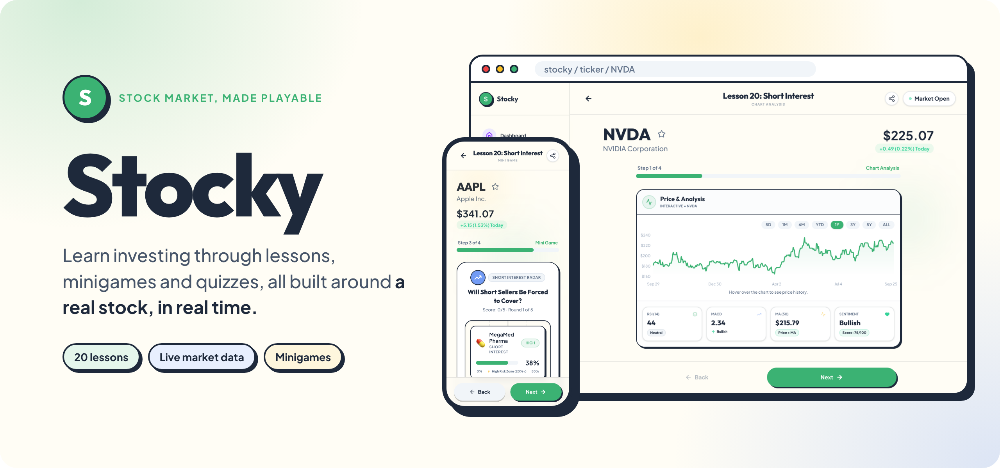
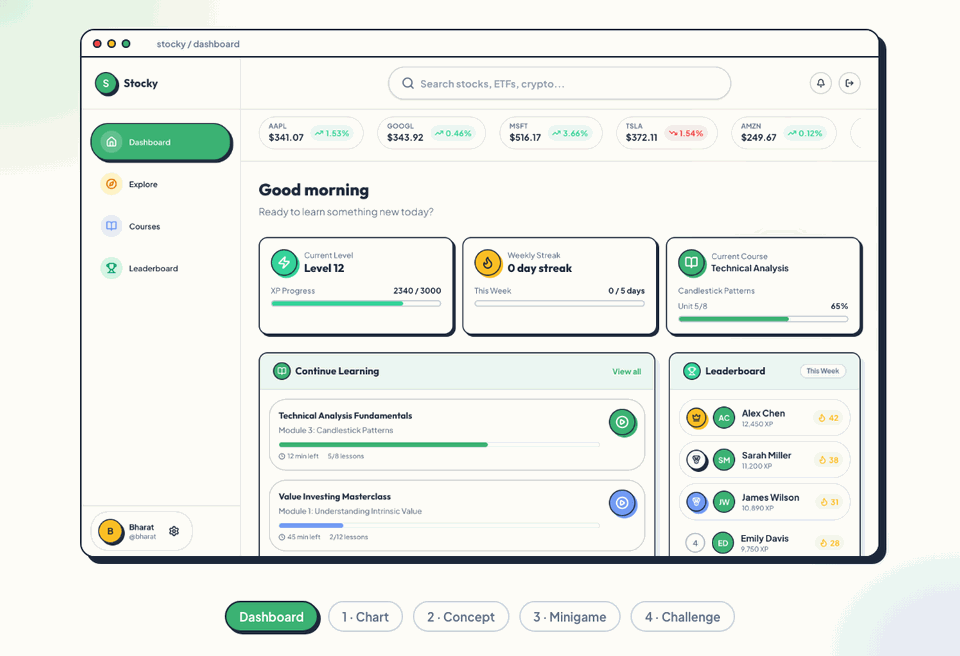
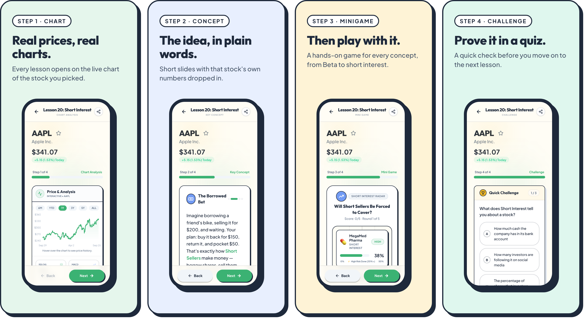

<p align="center">
  
</p>

<div align="center">


**Learn investing through lessons, minigames and quizzes, all built around a real stock in real time.**<br>
<sub>Web app · Next.js · FastAPI · yfinance</sub>

[Overview](#overview) · [Highlights](#highlights) · [Screenshots](#screenshots) · [How it works](#how-it-works) · [Getting started](#getting-started) · [Status](#status-and-roadmap)

</div>

<p align="center">
  
  <br>
  <sub>One full lesson on NVDA: the live chart, the concept, the Short Interest Radar minigame, and the challenge.</sub>
</p>

## Overview

Stocky teaches the stock market by making every lesson about a stock you actually care about. Search any ticker (`AAPL`, `TSLA`, `NVDA`) and Stocky picks the concept that fits it best, then walks you through it with that company's live numbers.

A high-volatility stock might teach you Beta; a dividend payer might teach you yield. Each lesson runs as a four-step flow: the live chart, a short concept carousel, a hands-on minigame, and a quick challenge.

## Highlights

| Feature | What it does |
|---|---|
| **Personalised to a real stock** | Live price, chart and fundamentals from the ticker you searched are dropped into every slide. |
| **Lessons picked for the stock** | A selector chooses the most relevant of 20 concepts for that company, from P/E ratio to short interest. |
| **A minigame for every concept** | Twenty-plus interactive games, such as the Short Interest Radar, Beta Shadow and Yield Magnet. |
| **Four-step LearningFlow** | Chart, concept, minigame, challenge, with progress shown at every step. |
| **Live chart analysis** | Interactive price history from 5 days to all time, with RSI, MACD, 50-day average and sentiment. |
| **Dashboard with streaks** | Weekly streaks, a daily quiz, courses and a leaderboard view. |

## Screenshots

<p align="center">
  
</p>

## How it works

The FastAPI backend pulls live market data and assembles a lesson for the ticker; the Next.js frontend runs it as a LearningFlow.

```text
 Search a ticker (e.g. NVDA)
     │
     ▼
 FastAPI backend
 ├─ yfinance ─────────── price, history, fundamentals, short interest
 ├─ technicals ───────── RSI · MACD · 50-day average · sentiment score
 ├─ smart selector ───── picks the lesson that fits this stock
 └─ curriculum ───────── slides with the stock's own numbers injected
     │
     ▼
 Next.js LearningFlow
 1 Chart  ─▶  2 Concept  ─▶  3 Minigame  ─▶  4 Challenge
     │
     ▼
 Supabase ── accounts, streaks, lesson rotation, feedback
```

- **Content is written, then personalised.** Lessons come from a static curriculum; live values such as a company's short-interest percentage are injected into the copy.
- **Results are cached** by type: prices for 5 minutes, concepts for 6 hours, quizzes for 7 days.
- **Works without an AI model.** An optional Ollama model can add generated context; without it, the built-in curriculum is used.

<details>
<summary><strong>The 20 lessons</strong></summary>

| # | Topic | # | Topic |
|---|---|---|---|
| 1 | Ticker symbols | 11 | Revenue vs. profit |
| 2 | Stock exchanges | 12 | EPS (earnings per share) |
| 3 | Supply and demand | 13 | P/E ratio |
| 4 | Bull vs. bear sentiment | 14 | Dividend yield |
| 5 | Market cap | 15 | Beta |
| 6 | IPOs | 16 | Earnings reports |
| 7 | Stock sectors | 17 | 52-week range |
| 8 | Volume | 18 | Liquidity |
| 9 | Volatility | 19 | Supply constraints |
| 10 | Dividends | 20 | Short interest |

</details>

## Tech stack

| Layer | Tools |
|---|---|
| **Frontend** |      |
| **Backend** |    |
| **Data** |  -000000?style=flat-square&logo=ollama&logoColor=white) |

## Getting started

**Requirements**

- Python 3.9+ and Node.js 20+
- Optional: a Supabase project for accounts and streaks, and an Ollama host

### 1. Start the backend

```bash
cd backend
pip install -r requirements.txt
uvicorn main:app --reload        # http://localhost:8000
```

### 2. Start the frontend

```bash
cd frontend
npm install
npm run dev                      # http://localhost:3000
```

### 3. Configure

Create `frontend/.env.local` with your Supabase project, and `backend/.env` with the same keys:

```bash
NEXT_PUBLIC_SUPABASE_URL=...
NEXT_PUBLIC_SUPABASE_ANON_KEY=...
```

The backend also reads `SUPABASE_URL`, `SUPABASE_KEY`, and optionally `OLLAMA_HOST` and `OLLAMA_MODEL`. Sign in, search a ticker and start learning.

<details>
<summary><strong>Project structure</strong></summary>

```text
backend/
├─ main.py               FastAPI app: ticker data, lesson generation, daily quiz
├─ static_curriculum.py  the 20 lessons and their slides
├─ smart_selector.py     picks the lesson that fits a stock
├─ lesson_triggers.py    rules that map stock traits to lessons
├─ cache.py              TTL caching for prices, concepts and quizzes
└─ supabase_client.py    lesson rotation and feedback

frontend/
├─ app/                  dashboard, ticker/[symbol], login, reset-password
├─ components/games/     one minigame per concept
├─ components/ticker/    the LearningFlow steps
└─ components/dashboard/ stats, courses, daily quiz, leaderboard
```

</details>

## Status and roadmap

In active development and run locally; not deployed yet.

- [x] Live market data and interactive charts
- [x] 20 lessons with stock-specific content
- [x] A minigame for every concept
- [x] Dashboard with streaks and a daily quiz
- [ ] Public deployment
- [ ] Live leaderboard from real accounts

## License

No licence has been published for this project yet, so all rights are reserved by default.

---

<div align="center">
  <sub>Built by <a href="https://github.com/waterduckpani">Bharat Khanna</a> · <a href="https://github.com/waterduckpani?tab=repositories">More projects</a></sub>
</div>
